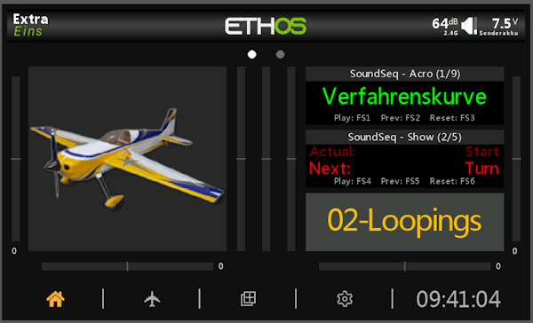
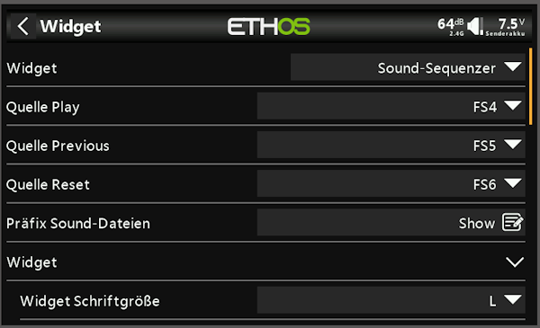
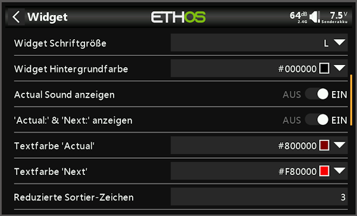
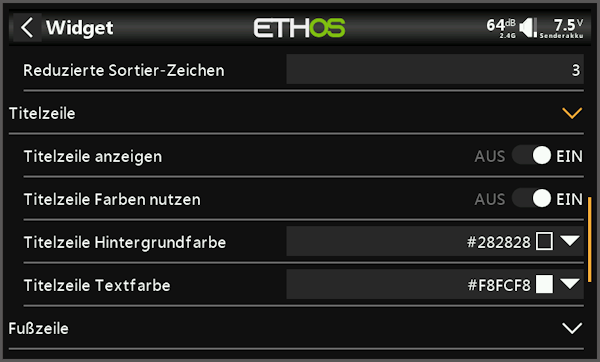
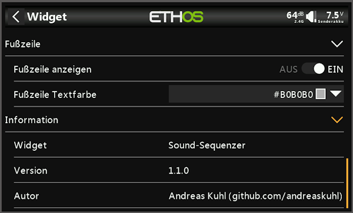

## 🌐 Andere Sprachen | Other Languages
- [Englisch | English](readme.md)
  
ℹ️ Die englische Version ist KI-Übersetzt von der deutschen Version readme.de

***

<h1 name="top"> SOUNDSQ | Sound-Sequenzer </h1>
FrSky-Ethos-Widget zum Abspielen sequenzieller Sprachansagen (Sounddateien). Der Einsatzzweck ist z.B. die Ansage der Flugmanövern / Figuren die man in einem Wettbewerb oder eine Flugshow absolvieren möchte.
       
Version 1.1.0

|                      |                                                              |
| -------------------- | ------------------------------------------------------------ |
| Entwicklungsumgebung | Ethos X20S-Simulator 1.6.3                                   |
| Testumgebung         | FrSky Tandem X20, Ethos 1.6.3 EU, Bootloader 1.4.15          |
| Autor                | Andreas Kuhl (https://github.com/andreaskuhl), Benno Jurisch |
| Lizenz               | GPL 3.0                                                      |

Wenn es Ihnen gefällt, können Sie es mit einer Spende unterstützen!

  

***

- [Funktionalität](#funktionalität)
- [Ideen zu weiteren Funktionen \& Verbesserung](#ideen-zu-weiteren-funktionen--verbesserung)
- [Installation](#installation)
- [Danksagung](#danksagung)
- [Bilder](#bilder)
- [Release Informationen](#release-informationen)

# Funktionalität

  - **Abspiel-Funktion (Play)**  
  Wiedergabe der nächsten Sprachansage (Next) mittels frei definierbarer Quelle (z.B. "FS1"). Mit dem Wiedergabestart wird automatisch die nächste Sprachansage ("Next:") angezeigt und ist abspielbereit. Nach dem Start des Senders, einem Modellwechsel und mit dem Abspielen der letzten Sprachansage wird automatisch immer die erste Sprachansage angezeigt.  
  Wenn gewünscht, kann man auch zusätzlich die aktuellen Sprachansage "Actual:" anzeigen lassen. Diese wird immer oberhalb des nächsten Sprachansage in kleinerer Schrift dargestellt.
  - **Vorherige-Funktion (Previous / Prev)**  
  Zurücksetzen der nächsten Sprachansage um eine Position (maximal zur ersten) mittels frei definierbarer Quelle (z.B. "FS2") - optional.
  - **Zurücksetz-Funktion (Reset)**  
  Zurücksetzen der nächsten Sprachansage auf die erste Position mittels frei definierbarer Quelle (z.B. "FS3") - optional.
  - **Listen-Selektion (Prefix)**  
  Es können mehrere Sprachansage-Listen durch einen Prefix am Dateinamen definiert werden. Bsp.: "acro01-Start.wav", "acro02-Looping.wav", ... und "show01-Start.wav", "show02-Turn.wav", ... -> Der Prefix (hier z.B. "acro") wird, genauso wie die Dateinamenserweiterung, zur Anzeige des Titels ausgeblendet (hier also "01-Start", "02-Looping", ...)
  - **Sortierung der Sprachansagen**  
  Sprachansagen werden sequentiell durch die Wiedergabefunktion (Play) in alphabetischer Reihenfolge des Dateinamens wiedergegeben.
  Um die Sortierung in der gewünschten Reihenfolge zu erreichen, sollten dem eigentlichen Titel Sortierzeichen vorausgestellt werden. Im Beispiel oben wäre das "01-", "02-" usw.. Um die Titel-Anzeige zu optimieren (lange Titel möglichst groß anzuzeigen), kann man diese Zeichen ausblenden, indem man die Anzahl der reduzierten Sortierzeichen auf 3 einstellt. Stellt man hier eine 0 ein, werden alle Titel mit den Sortierzeichen (Nummerierung) angezeigt.
  - **Mehrfacheinsatz**  
  Das Widget, genauso wie die Sprachansagen & -Listen, können mehrfach eingesetzt werden, sowohl in einem Modell als auch in verschiedenen Modellen. Es sollte in einem Modell jedoch darauf geachtet werden, dass die Steuerungsbelegung (Play, Prev, Reset) in einem Modell nicht mit gleichen Quellen belegt werden.
  - **Anzeige Individualisierung** 
  Titelzeile (Widget-Kurzename - Prefix und Index/Titelanzahl) ein/ausschalten, Fußzeile (Titelsteuerung) ein/ausschalten, getrennt wählbare Text- und Hintergrund-Farbe für Titel und Widget-Text und Fußzeile, Text "Actual:" & "Next:" ein/ausschalten
  - **Lokalisierung**
  Sprachunterstützung ind Englisch (en - Standard) und Deutsch (de).
  

# Ideen zu weiteren Funktionen & Verbesserung
  - Weitere Lokalisierung -> Bei Bedarf einfach melden ... oder noch besser eine Übersetzung zuliefern.
  - Wenn jemand eine kurze & intuitive deutsche Übersetzung für Play, Prev, Restart und Next hat, wäre ich sehr dankbar.  
  Noch besser: Eine Visualisierung mit Symbolen, aber mit funktionierender Ethos-lua-Implementierung!  
  
  Bitte melden wenn dafür, bzw. anderen Funktionen, ein Bedarf besteht.  
  => In GitHub ein Issue einstellen, natürlich ebenso bei Fehlern!
  
  
# Installation
- Ggf. bestehende alte / Vorgänger Version löschen (gesamtes Verzeichnis des alten Widgets). Achtung: eigene Sound-Dateien vorher sichern.
- Aus dem aktuellen GitHub-Release die sound_x_x_x.zip herunterladen und daraus das Verzeichnis "soundsq" in das "scripts"-Verzeichnis der X20-SD-Karte kopieren.
- Alte / eigene Sound-Dateien in das "sounds" Unterverzeichnis kopieren
- Beim nächsten Sender-Start sollte das Widget auswählbar sein bzw. auch in den bestehenden Konfigurationen mit neuer Funktionalität nutzbar sein.
- ... eigene individuelle Sound-Dateien in das "sounds" Unterverzeichnis kopieren und ggf. die mitgelieferten Demo-Sounds löschen.

# Danksagung
Vielen Dank die  die folgenden Mitstreiter:
- Initiale Idee/Anforderung von Hannes Mössler
- v0.1.0 Benno Jurisch (Basis Entwicklung)

# Bilder
    

# Release Informationen

| Version |   Datum    | Veränderung                                                                                                                                                                                                                                           | Autor         |
| ------: | :--------: | ----------------------------------------------------------------------------------------------------------------------------------------------------------------------------------------------------------------------------------------------------- | ------------- |
|   1.1.0 | 03.10.2025 | Anzeige des Actual-Titels, Darstellung für große Widgets optimiert, Darstellungsoptionen erweitert: "Actual:" & "Next:" ausschaltbar, Unterschiedliche Textfarben Actual/Next, Ausblenden der Sortierzeichen, Gruppierung der Konfigurationselemente. | Andreas Kuhl  |
|   1.0.0 | 23.09.2025 | Komplettes Code-Refactoring, Vorherige-Funktion (Prev), erweiterte Anzeige-Individualisierung und Dokumentation.                                                                                                                                      | Andreas Kuhl  |
|   0.2.0 | 14.09.2025 | Prefix (Listen-Filter) für Mehrfachnutzung mit unterschiedlichen Ansage-Listen.                                                                                                                                                                       | Andreas Kuhl  |
|   0.1.0 | 14.09.2025 | Sequentielles sortiertes Abspielen mit Reset.                                                                                                                                                                                                         | Benno Jurisch |

[↑ Zurück nach oben](#top)
