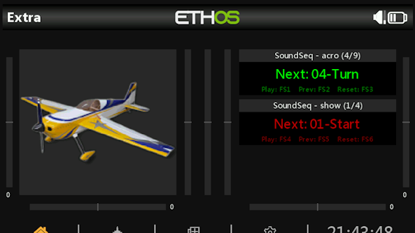
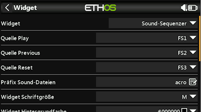

## 🌐 Other Languages | Andere Sprachen
- [German | Deutsch](readme.de.md)
  
ℹ️ The German version is the original, this English version is AI-translated from readme.de

***

<h1 name="top"> SOUNDSQ | Sound Sequencer </h1>
FrSky-Ethos widget for playing sequential voice announcements (sound files).
       
Version 1.0.0

|                      |                                                              |
| -------------------- | ------------------------------------------------------------ |
| Development Env.     | Ethos X20S Simulator 1.6.3                                   |
| Test Env.            | FrSky Tandem X20, Ethos 1.6.3 EU, Bootloader 1.4.15          |
| Author               | Andreas Kuhl (https://github.com/andreaskuhl), Benno Jurisch |
| License              | GPL 3.0                                                      |

If you like it, you can support it with a donation!

  

- [Functionality](#functionality)
- [Ideas for further features \& improvements](#ideas-for-further-features--improvements)
- [Installation](#installation)
- [Acknowledgements](#acknowledgements)
- [Images](#images)
- [Release Information](#release-information)

# Functionality

  - **Play Function**  
  Plays the next voice announcement (Next) via a freely definable source (e.g. "FS1"). When playback starts, the next title (Next) is automatically displayed and ready to play. After transmitter start, model change, and after playing the last title, the first title is always displayed automatically.
  - **Previous Function (Prev)**  
  Resets the next voice announcement by one position (up to the first) via a freely definable source (e.g. "FS2") - optional.
  - **Reset Function**  
  Resets the next voice announcement to the first position via a freely definable source (e.g. "FS3") - optional.
  - **Sorting of Voice Announcements**  
  Voice announcements are played sequentially in alphabetical order of the filename.
  - **List Selection (Prefix)**  
  Multiple voice announcement lists can be defined by a prefix in the filename. Example: "acro01-Start.wav", "acro02-Looping.wav", ... and "show01-Start.wav", "show02-Turn.wav", ... -> The prefix (e.g. "acro") and the file extension are hidden in the title display (so "01-Start", "02-Looping", ...).
  - **Multiple Usage**  
  The widget, as well as the voice announcements & lists, can be used multiple times, both in one model and in different models. In one model, make sure that the control assignments (Play, Prev, Reset) are not assigned to the same sources.
  - **Display Customization**  
  Show/hide title (widget short name - prefix and index/title count), separately selectable text and background color for title, widget text, and footer.
  - **Localization**
  Language support in English (en - default) and German (de).
  

# Ideas for further features & improvements
  - More localization -> Just ask if needed ... or even better, contribute a translation.
  - If anyone has a short & intuitive German translation for Play, Prev, Restart, and Next, I would be very grateful.  
  Even better: Visualization with symbols, but with working Ethos-lua implementation!  
  
  Please get in touch if you need this or other features.  
  => Create an issue on GitHub, also for bugs!
  
  
# Installation
- If present, delete any old/previous version (at least main.lua, better the whole directory of the old widget). Attention: backup your own sound files first.
- Download sound_x_x_x.zip from the current GitHub release and copy the "soundsq" directory into the "scripts" directory of the X20 SD card.
- Copy old sound files into the "sounds" subdirectory
- On next transmitter start, the widget should be selectable or usable in existing configurations with new functionality.
- ... as needed, copy more sound files into the "sounds" subdirectory

# Acknowledgements
Many thanks to the following contributors:
- Initial idea/requirement by Hannes Mössler
- v0.1.0 Benno Jurisch (base development)

# Images
 

# Release Information

| Version |   Date     | Change                                                                                                          | Author         |
| ------: | :--------: | -------------------------------------------------------------------------------------------------------------- | ------------- |
|   0.1.0 | 14.09.2025 | Sequential sorted playback with reset.                                                                         | Benno Jurisch |
|   0.2.0 | 14.09.2025 | Prefix (list filter) for multiple usage with different announcement lists.                                     | Andreas Kuhl  |
|   1.0.0 | 23.09.2025 | Complete code refactoring, previous function (Prev), extended display customization and documentation.          | Andreas Kuhl  |

[↑ Back to top](#top)
