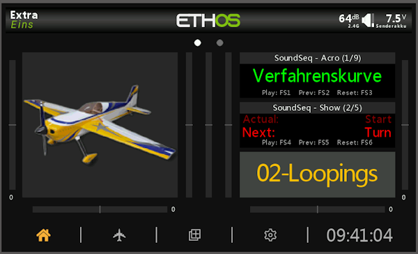
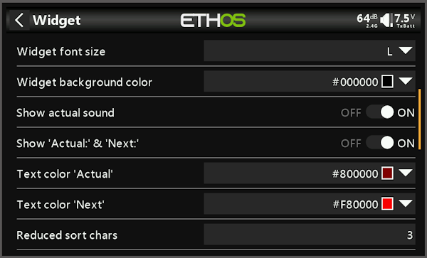

## 🌐 Other Languages | Andere Sprachen
- [German | Deutsch](readme.de.md)
  
ℹ️ The German version is the original, this English version is AI-translated from readme.de

***

<h1 name="top"> SOUNDSQ | Sound Sequencer </h1>
FrSky Ethos widget for playing sequential voice announcements (sound files). The intended use is, for example, announcing flight maneuvers/figures that you want to perform in a competition or airshow.

Version 1.1.0

|                      |                                                              |
| -------------------- | ------------------------------------------------------------ |
| Development Env.     | Ethos X20S Simulator 1.6.3                                   |
| Test Env.            | FrSky Tandem X20, Ethos 1.6.3 EU, Bootloader 1.4.15          |
| Author               | Andreas Kuhl (https://github.com/andreaskuhl), Benno Jurisch |
| License              | GPL 3.0                                                      |

If you like it, you can support it with a donation!

  

***

- [Functionality](#functionality)
- [Ideas for Further Features \& Improvements](#ideas-for-further-features--improvements)
- [Installation](#installation)
- [Acknowledgements](#acknowledgements)
- [Images](#images)
- [Release Information](#release-information)

# Functionality

  - **Play Function**
  Playback of the next voice announcement (Next) via a freely definable source (e.g. "FS1"). When playback starts, the next voice announcement ("Next:") is automatically displayed and ready to play. After starting the transmitter, changing the model, and after playing the last voice announcement, the first voice announcement is always displayed automatically.
  If desired, you can also display the current voice announcement "Actual:". This is always shown above the next voice announcement in smaller font.
  - **Previous Function (Previous / Prev)**
  Reset the next voice announcement by one position (up to the first) via a freely definable source (e.g. "FS2") - optional.
  - **Reset Function**
  Reset the next voice announcement to the first position via a freely definable source (e.g. "FS3") - optional.
  - **List Selection (Prefix)**
  Multiple voice announcement lists can be defined by a prefix in the filename. Example: "acro01-Start.wav", "acro02-Looping.wav", ... and "show01-Start.wav", "show02-Turn.wav", ... -> The prefix (e.g. "acro") is hidden in the display, as is the file extension, so only the actual title is shown (e.g. "01-Start", "02-Looping", ...).
  - **Sorting of Voice Announcements**
  Voice announcements are played sequentially in alphabetical order of the filename. To achieve the desired order, sorting characters should be placed before the actual title. In the example above, this would be "01-", "02-", etc. To optimize the title display (show long titles as large as possible), you can hide these characters by setting the number of reduced sorting characters to 3. If you set this to 0, all titles are displayed with the sorting characters (numbering).
  - **Multiple Use**
  The widget, as well as the voice announcements & lists, can be used multiple times, both in one model and in different models. However, in one model, make sure that the control assignment (Play, Prev, Reset) is not assigned to the same sources.
  - **Display Customization**
  Title line (widget short name - prefix and index/title count) can be toggled on/off, footer (title control) can be toggled on/off, separately selectable text and background color for title and widget text and footer, "Actual:" & "Next:" text can be toggled on/off.
  - **Localization**
  Language support in English (en - default) and German (de).

# Ideas for Further Features & Improvements
  - Further localization -> If needed, just let me know ... or even better, provide a translation.
  - If anyone has a short & intuitive German translation for Play, Prev, Restart, and Next, I would be very grateful.
  Even better: A visualization with symbols, but with working Ethos-lua implementation!
  
  Please get in touch if there is a need for this or other features.
  => Create a GitHub issue, of course also for bugs!

# Installation
- If necessary, delete any old/previous version (entire directory of the old widget). Attention: back up your own sound files first.
- Download the sound_x_x_x.zip from the current GitHub release and copy the "soundsq" directory into the "scripts" directory of the X20 SD card.
- Copy old/own sound files into the "sounds" subdirectory
- At the next transmitter start, the widget should be selectable or usable in existing configurations with new functionality.
- ... copy your own individual sound files into the "sounds" subdirectory and optionally delete the supplied demo sounds.

# Acknowledgements
Many thanks to the following contributors:
- Initial idea/requirement by Hannes Mössler
- v0.1.0 Benno Jurisch (basic development)

# Images
    

# Release Information

| Version |   Date     | Change                                                                                                                                                                                                                                           | Author         |
| ------: | :--------: | ------------------------------------------------------------------------------------------------------------------------------------------------------------------------------------------------------------------------------------------------ | ------------- |
|   1.1.0 | 03.10.2025 | Display of the Actual title, optimized for large widgets, extended display options: "Actual:" & "Next:" can be toggled, different text colors for Actual/Next, hiding sorting characters, grouping configuration elements.                        | Andreas Kuhl  |
|   1.0.0 | 23.09.2025 | Complete code refactoring, Previous function (Prev), extended display customization and documentation.                                                                                                                                            | Andreas Kuhl  |
|   0.2.0 | 14.09.2025 | Prefix (list filter) for multiple use with different announcement lists.                                                                                                                                                                         | Andreas Kuhl  |
|   0.1.0 | 14.09.2025 | Sequential sorted playback with reset.                                                                                                                                                                                                           | Benno Jurisch |

[↑ Back to top](#top)
